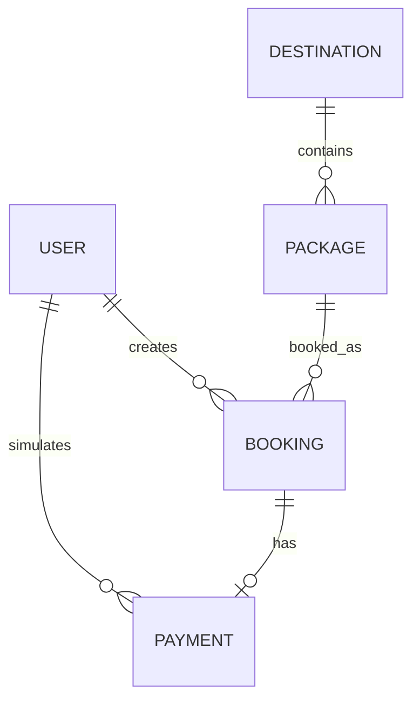

# Database design

Database: `travelmate` on MongoDB Atlas. Mongoose schemas use timestamps and explicit validation. Atlas replica-set transactions keep payments and bookings consistent.

| Model | Main fields | Constraints and references |
| --- | --- | --- |
| User | name, email, passwordHash, phone, role | unique normalized email; passwordHash excluded by default; USER/ADMIN |
| Destination | name, slug, state, country, description, shortDescription, heroImage, gallery, bestTimeToVisit, attractions, basicTravelInformation, active | unique slug |
| Package | name, slug, destination, descriptions, type, price, days/nights, maximumTravelers, transport/stay/local transport, places, itinerary, inclusions/exclusions, images, featured, popularity, availability dates | unique slug; destination reference; embedded itinerary; availability/price index |
| Booking | code, requestId, user, package, snapshots, travelDate, travelers, count, booked price, total, booking/payment status, cancellation | unique code; unique user/requestId; user/package refs; embedded travelers |
| Payment | transactionId, booking, user, amount, method, status, paidAt | unique transactionId and booking; booking/user refs |
| RateLimit | key, count, expiresAt | hashed identity/window key; unique key; TTL expiry |

Travelers and itinerary days are embedded because they belong to one parent and are normally read together. Users, packages and destinations are referenced because they are independently managed and reused.

Snapshots include package/destination names, image, duration, pricePerPersonAtBooking and totalAmount. An administrative price edit never changes an earlier booking. Deactivation keeps references valid.

Payment/refund updates execute in one transaction. Payment uniqueness prevents double successful records; repeating an already successful payment returns the confirmed booking. Failed simulations can be retried. Seed uses insert-only upserts by stable slugs/email and initializes unique indexes before use.
