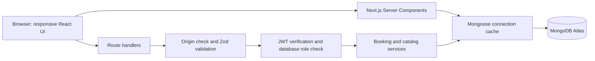

# System architecture

Vercel runs the Next.js Node runtime. Public pages query the database on the server; interactive forms use same-origin JSON APIs. There are no client-side database credentials. Environment variables contain Atlas access and signing/seed secrets.

Authentication: registration normalizes email and hashes the password using bcrypt cost 12. A jose HS256 token contains only the subject identity and standard claims. The HTTP-only cookie expires after seven days and uses SameSite=Lax plus Secure in production. Protected APIs retrieve the current user and role from MongoDB. Layout guards improve navigation but never substitute for API authorization. Logout expires the cookie.

Auth throttling persists hashed email/IP time buckets in MongoDB. Vercel's trusted IP header is used in production; local development uses a shared local bucket. Write handlers require a matching Origin. Zod constructs accepted inputs, queries are composed server-side, and regular-expression search terms are escaped.

Payments and cancellations use transactions. Unique indexes plus status guards prevent duplicate financial simulation records and invalid state changes. Admin completion uses a conditional update. Error responses expose safe messages rather than stack traces or connection credentials.

Build and deploy: npm lockfile → lint/types/tests → production build → GitHub → Vercel → live HTTP/database and browser verification. Seed is an operator-run script, never a public reset endpoint.
